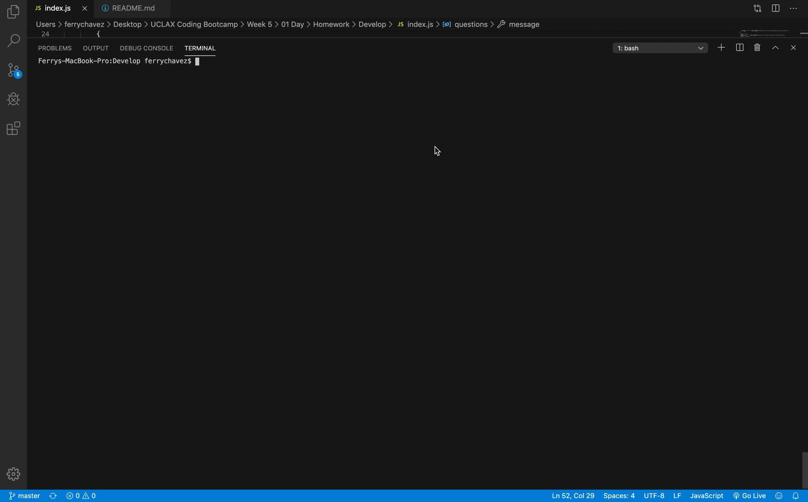

<h1 style="text-align:center"> 👋 Welcome to your project! </h1>
 
# 💻 Demo 
 
 
            
 
# 🗳 PROJECT NAME: README Project 
 
## 🗒 Project Description 
 
 This project helps you generate good README.md files via Node.
 
## ✨ TABLE OF CONTENTS 

            1. Usage

            2. Languages

            3. License

            4. Contribution

            5. Installation

            6. Test
 
            
## 📚 Usage 
 
 This will make your life easier in making README files.
 
## 🙊 Languages Needed 
 
 JavaScript,Mangose,Express,React,Node,MySQL
 
## 💳 License 
 
 This project is under the MIT license
 
## 💬 Contribution 
 
 Always read documentations!
 
## 🧩 Installation 
 
 To install the necessary dependencies, run the following command:

            npm install 
 
## 🏃‍♂️ Test 
 
 To run the test, use the following command: 
 npm teat 
 
## 🙌👏This project exists thanks to this person who contributed. 

                </img> 
